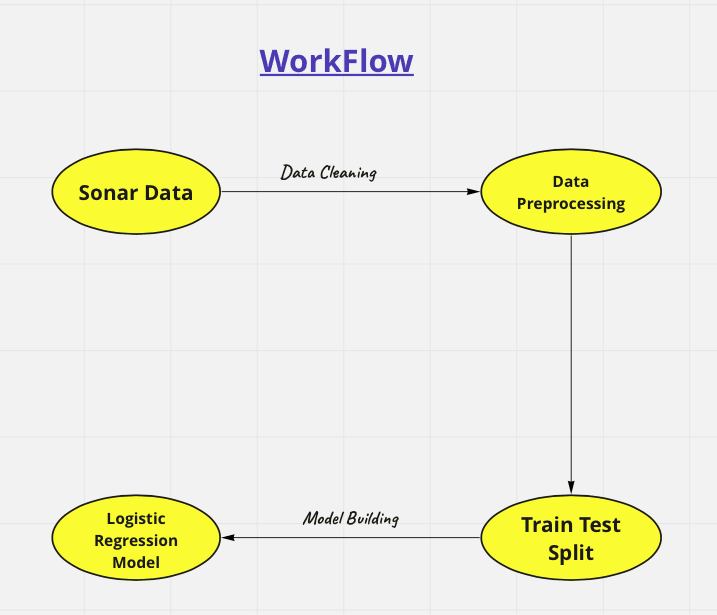
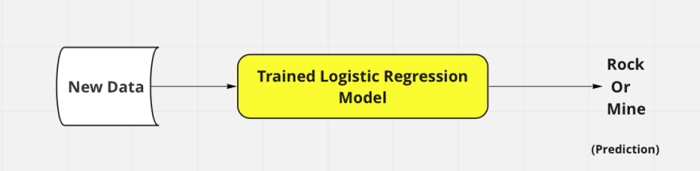

# Rock_or_Mine_Prediction
Welcome to the "Rock or Mine Prediction" project repository. In this project, we use machine learning techniques to predict whether underwater objects are rocks or mines based on sonar signal patterns. The dataset used for this project is the Sonar dataset, which contains sonar signals reflected from metal cylinders (mines) and rough cylindrical rocks. The SONAR technique has revolutionized rock and mineral detection, simplifying what used to be a complex process. By leveraging specific parameters, this method efficiently identifies surface obstacles like rocks and mines. Machine learning is a pivotal force in modern technology. Predictive analytics advancements are showcased in this prediction method, utilizing machine learning algorithms like logistic regression, easily accessible through Google Colab.

## Open in Colab

# Project Overview
The primary goal of this project is to demonstrate how machine learning can be applied to classify underwater objects as either rocks or mines. We explore different algorithms, preprocessing techniques, and evaluation model to build an effective prediction model.

# Dataset
The Sonar dataset is obtained from "Kaggle, The Data Science Community". It comprises 208 sonar signals, each representing the response of a sonar chirp signal bounced off an underwater object. The dataset is labeled with two classes: "M" (mine) and "R" (rock). This data is used for training and testing purpose. The Last column in this dataset indicates that, whether it's a mine or a rock, which is useful in prediction. The dataset is included in this repository.

# Installation
To run the code and notebooks in this repository, you need to have Python 3.x installed along with the following libraries:

NumPy
Pandas
Scikit-learn
Matplotlib
Seaborn
Jupyter Notebook or Google Collab (for running the provided notebooks)
You can install these dependencies using the following command:
pip install numpy pandas scikit-learn matplotlib jupyter

# Data Pre-Prrocessing
The training and testing process involves utilizing CSV-based sonar data. This data undergoes essential preprocessing to align with optimal training requirements. Following preprocessing, we construct a Logistic Regression model. The dataset is then divided into separate training and testing subsets. The training subset trains the model, while the trained Logistic Regression model predicts outcomes on new or testing data, facilitating accurate predictions.

# Data Visualization
Created visualizations (countplot and strip plot) to gain insights into the distribution and relationships between features. Visualizations can help in identify patterns and potential challenges in the dataset.

# Building the Model
The chosen model is Logistic Regression, a statistical approach that employs a logistic function to model a binary dependent variable. Utilizing a sigmoid or logit function, it molds a best-fit line to map various values within a 0 to 1 range, adopting an "S" shaped curve. The sigmoid function effectively handles outliers, constraining outputs between 0 and 1. Given its binary nature, Logistic Regression aptly predicts rock or mine classification using sonar data.

## Lessons Learned

- This is my First Machine Learning Project where i learned that Data Pre-Processing is a necessary step to build a good predictive model
- I also learned that through Data visualization we can draw insights about the dataset
- This Project has taught me the concept of model building and evaluation by using various python and it's libraries.
- I also have created a Predictive System in which, it will take some input and will predict whether the object is "rock" or "mine".
- In the end, I have saved the model for Deployment purpose.

# Conclusion

